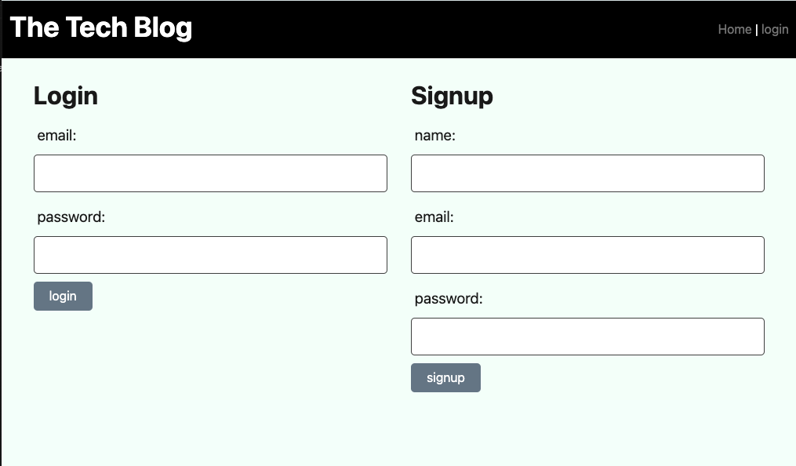

# Tech-Blog

## Description

Writing about tech can be just as important as making it. Developers spend plenty of time creating new applications and debugging existing codebases, but most developers also spend at least some of their time reading and writing about technical concepts, recent advancements, and new technologies. This is a CMS-style blog site similar to a Wordpress site, where developers can publish their blog posts and comment on other developers’ posts as well. This app follows the MVC paradigm in its architectural structure, using Handlebars.js as the templating language, Sequelize as the ORM, and the express-session npm package for authentication.

## Usage

Developers will use this CMS-style blog site to publish articles and share thoughts/opinions in blog posts. 

## Mock-Up

The following image displays the home login page:



## Packages and Installation

* <b>express-handlebars</b>
    ````md
    npm install express-handlebars
    ````
* <b>pg</b>
    ````md
    npm install pg
    ````
* <b>sequelize</b>
    ````md
    npm i sequelize
    ````
* <b>dotenv</b>
    ````md
    npm install dotenv --save
    ````
* <b>bcrypt</b>
    ````md
    npm install bcrypt
    ````
* <b>express-session</b>
    ````md
    npm install express-session
    ````
* <b>connect-session-sequelize</b>
    ````md
    npm install connect-session-sequelize
    ````

### Sources:
* Activites from class
* Tutoring sessions
* Xpert Learning helper
* Module 14 mini-project